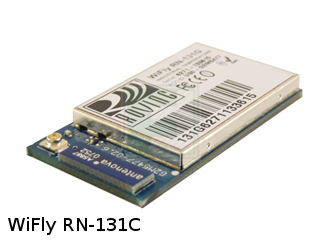
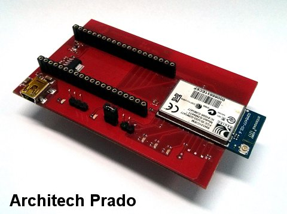

.. WIFIxpresso Board by Silica Architech documentation master file, created by
   sphinx-quickstart on Wed Apr 10 11:13:41 2013.
   You can adapt to your liking the file, being careful that the directive contains the root 'toctree'

Welcome to WIFIxpresso Board by Silica Architech's documentation!
=================================================================

:Version: 1.0.0
:Copyright: (C)2013 Silica an Avnet company

.. image:: _static/silicalogo.png

.. image:: _static/coderedlogo.png

| The daughterboard Architech WIFIxpresso of Silica helps to assess the **WiFly RN-131C** module (version **4.00**) of **Microchip**.
| It was designed to be connected to the **LPC1115 LPCXpresso board**.
| The project provides a demo developed with the **LPCXpresso IDE** and through the microcontroller **LPC1115** configures the **RN-131C** module to operate in different modes.

.. image:: _static/IMG1.PNG

| The **WiFly** radio module is a complete standalone **embedded wireless LAN access device**. 
| The device has on board TCP/IP stack and applications, requiring only 4 pins (**POWER, TX, RX, GND**) to design in. 
| Once initial configuration is set, the radio can automatically access the Wi-Fi network and send/receive serial data over **UART**.
|
| For a quick consultation of the instruments used, please visit the following websites:

* IDE LPCXPRESSO (free IDE up to 128KB):
	http://lpcxpresso.code-red-tech.com/LPCXpresso/

* LPC1115 LPCXpresso:
	http://www.embeddedartists.com/products/lpcxpresso/lpc1115_xpr.php
	http://www.nxp.com/techzones/microcontrollers-techzone/tools-ecosystem/lpcxpresso.html
	http://www.nxp.com/products/microcontrollers/cortex_m0_m0/LPC1115FBD48.html

* Connected to the WIFIxpresso daughterboard:

* Microchip RN-131C:
	http://www.microchip.com/wwwproducts/Devices.aspx?dDocName=en558369

* The demo has been developed starting from the design LPCOpen platform v1.03
	http://www.lpcware.com/content/nxpfile/lpcopen-platform

and with the demo of the microchip "RN171 and RN131 PICtail WebServer" ver 1.0R:
	http://www.microchip.com/stellent/idcplg?IdcService=SS_GET_PAGE&nodeId=1406&dDocName=en560211

|
| We suggest you to read the Quick Start Guide to setup your evaluation system

:ref:`quick`

This guide explains how to use this application and provides an overview of on the structure of the project firmware

.. toctree::
 :maxdepth: 2

 passthrough
 factoryreset
 updatern131c
 details

.. toctree::
 :hidden:
 
 quick   

* :ref:`search`

