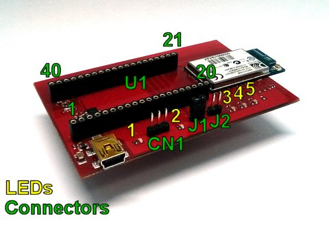

.. index:: Pass-Through mode

.. _passthrough:

Pass-Through Mode
=================

.. warning:: For using this mode you need a **UART interface (3,3V level only)** to connect Prado to your pc. **This interface is not provided**.

The demo provided can operate in **pass-through mode**. 
Enable this mode to be able to send and receive commands to the console manually through terminal WiFly module.
In order to enable this mode follow the following steps:

1. Insert the jumper connector **J1**

2. Connect to **CN1** (**UART 3,3V level only**) a UART interface (**not provided**) that will allow to connect the wifly module to your pc
::

 PIN1 = LPC_UART_RX (3,3V level)
 PIN2 = LPC_UART_TX (3,3V level)
 PIN3 = GND

3. The UART configuration is **Baud: 9600, Data: 8bit, Parity: None, 1bit stop, Flow: None**

4. Connect **Prado** to the **PC**

5. When the demo starts, **LED1** remain always turned on.

| At this point it is possible to **send commands** from the terminal and **receive response messages**. 
| For example, you can reset the module to factory defaults :ref:`factoryreset`.
| 
| For more information, about the WiFly console refer to the document **WiFly User Manual** from the site by clicking http://www.microchip.com/wwwproducts/Devices.aspx?dDocName=en558369 under **Documentation & Software**.

