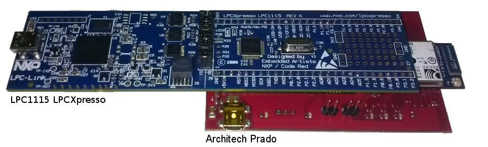
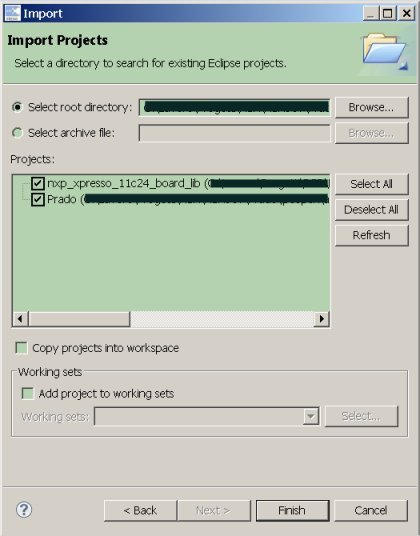

.. _quick:

Quick start guide
=================

.. index:: Hardware requirements

Hardware requirements
---------------------
To run the demo application, you need the following hardware:

* LPC1115 LPCXpresso Board

* Architech WIFIxpresso daughterboard

* 802.11b/g-compliant Wi-Fi access point **with access to internet**

* Two Jumper

* Two mini usb cables type B

* A pc/laptop with wireless device

|
| Optionally (for demo PASS-THROUGH MODE)

* level shifter UART 3v3

.. index:: Software Requirements

Software Requirements
---------------------

* Free LPCXpresso IDE: http://lpcxpresso.code-red-tech.com/LPCXpresso/

* Source of demo: **SILICA site**

|
| Optionally (for demo PASS-THROUGH MODE)

* Terminal emulator application such as Hyperterminal or other. You will use the terminal emulator to send configuration commands to the module over a UART interface. The emulator also displays information transmitted from the module.

Set Up Hardware
---------------

Perform the following steps to set up the hardware and prepare it for configuration:

1. In LPCXpresso Board connect **J4 PIN1** to **J4 PIN2**, **J4 PIN3** to **J4 PIN4**, ... **J4 PIN15** to **J4 PIN16**.

2. Plug the LPC1115 LPCXpresso Board connector into WIFIxpresso evaluation board.

3. remove the two jumpers **J1** and **J2**

4. connect the USB cable from the PC to the cards.

.. image:: _static/IMG4.JPG

5. Optionally connect the **level shifter** from the connector **CN1** to the PC 

6. make sure that the router is connected to internet and it is configured to accept the connection of the module RN-131C and it can access the internet.

.. index:: Install software

Set up Software
---------------

| When the demo will have configured your wifi module will access the Microchip web site.
| To enable access, follow these steps:

1. Register the module to the Microchip website:

* Browse to the website: http://mtt.mchpcloud.com and follow the instructions on the page to **create an account**.

* Logging in with the account that you have created and follow the instructions to **register the MAC address of the module**. Associate to a name, such as **MYRN131MODULE**. Later this name will be used to connect the demo server to the cloud. The MAC address of the module are the **last few 6-hex bytes** in the numerical sequence shown under the barcode module.

2. Install the **IDE LPCExpresso** and following the instructions of **default**

3. Importing the demo into your **LPCXpresso workspace**
To use the projects in LPCXpresso, they **must first be imported into LPCXpresso**. To import the projects, start LPCXpresso with a new workspace and select the **Import...** option from the File menu. Select the **Existing Projects into Workspace** option from the General section and press **Next**.
On the import dialog window in the **Select root directory** box, browse to the platform directory **lpcopen/applications/lpc11xx/xpresso_projects/nxp_xpresso_11c24/**.
Select **nxp_xpresso_11c24_board_lib** and **WIFIxpresso**.
Make sure the **Copy projects to workspace** option is **disabled**. Then select **Finish** to start the import.

The imported project should appear in the **Project Browser** window.

.. image:: _static/IMG8.JPG

4. Compile it by selecting from the menu **Build → Build All**

.. index:: Run demo

Run demo first time
-------------------

1. launches debugging by pressing the icon showed below:

2. All messages of the demo will be displayed on the debug console LPCXpresso IDE, see options.h for details.
After initialization, the dispositive will try to associate with an Access Point within 10 seconds.
The message **associating ...** will appear on the debug console.

3. After 10 seconds if it fails to join the demo will set the module as an Access Point (SOFT AP).
Once set, the message on the debug console **Config w / Browser http://5.16.71.1**.
In this state, the demo application will work as a small webserver, blue **LED2** blinks and red **LED4** is turned on.

4. The demo in this state, it is waiting for a connection request from a **browser**. 
As an Access Point, the module’s IP address is **5.16.71.1**. Its SSID is **mttSoftAP_xx_yy**, where xx & yy, are the last two hex bytes of the module’s MAC address (example mttSoftAP_03_06). 
Associate your PC to this access point.

.. image:: _static/IMG10.JPG

5. The module is listening for TCP address, open a browser (IE, Safari, Firefox) etc, and enter **http://5.16.71.1:2000/index.html** into the browser window.

.. image:: _static/IMG11.JPG

6. Insert in all areas, the **SSID** of the access point where the **RN-131C** can connect to access of internet, **Password** (appears in plain text), and the **channel auto-join**. After that click on the **Enter** button.

7. Now that the demo has all the information to access the Access Point sets the WIFI module with all the data and try to access.
It is important that there are no filters on the network that prevent the module to access the internet otherwise the demo can not continue. 

8. Set the PC to access the access point and go with the company http://mtt.mchpcloud.com browser to the site. 
Log in and select the name chosen previously, for example **MYRN131MODULE**. 
Press the **Connect** button to enable communication between the module and the WiFly cloud server. 
Once connected you will see on the website the data transmitted from the demo.

